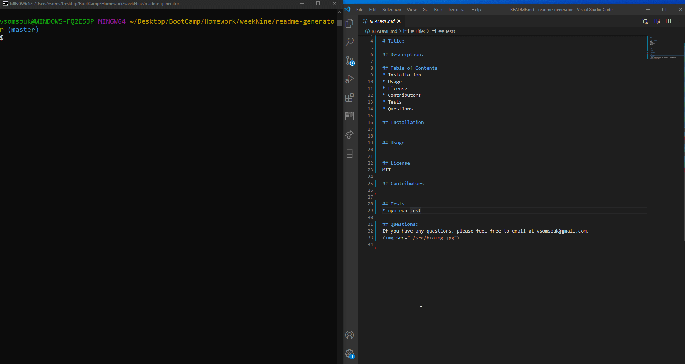

ReadMe Generator

## Description
Using node.js to generate a readme file.

## Table of Contents
* Installation
* Usage
* License
* Contributors
* Tests
* Questions

## Installation
npm install

## Usage
node index.js

## License
MIT  

## Contributors
Vanida

## Tests
* npm run test

## Questions:
If you have any questions, please feel free to email me at vsomsouk@gmail.com.  

## Demo

## Screenshot
